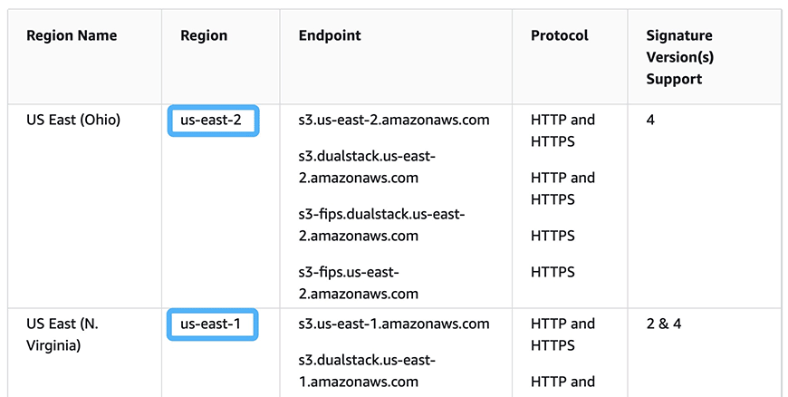
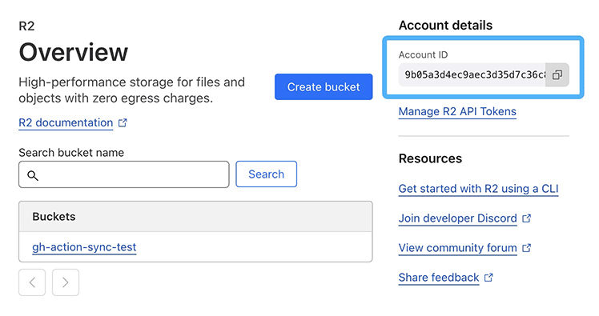
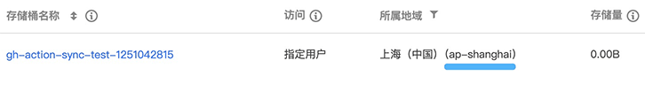
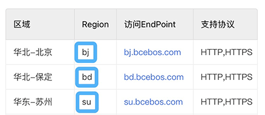

# Sync S3-Compatible Action

The `sync-s3-compatible-action` is a GitHub action which can sync a directory to an S3-compatible storage. Currently supports:

- AWS S3
- CloudFlare R2
- Aliyun OSS
- QCloud COS
- Baidu Cloud BOS

## Parameters

The `sync-s3-compatible-action` takes the following parameters as inputs:

| Name               | Default Value | Required | Description                   |
|--------------------|---------------|----------|-------------------------------|
| sync_dir           | `_site`       | No       | Source directory to sync      |
| sync_type          | `aws`         | No       | Cloud storage provider        |
| sync_bucket        |               | Yes      | Bucket name.                  |
| sync_region        |               | Yes      | Region name.                  |
| sync_access_id     |               | Yes      | Access id for API access.     |
| sync_access_secret |               | Yes      | Aceess secret for API access. |
| sync_opt_unused    | `keep`        | No       | How to process files exist on cloud storage but not exist in local. |

## Notes

- `sync_access_id` and `sync_access_secret` are confidential and should NOT be public. Add these values as [encrypted secrets](https://docs.github.com/en/actions/security-for-github-actions/security-guides/using-secrets-in-github-actions) and pass the secrets as inputs.
- Files which exist on cloud storage but not exist in local directory will be keeped by default. To remove unused files you must set `sync_opt_unused` to `delete` explicitly.

## Configurations

### AWS

AWS S3 regions can be found on [this page](https://docs.aws.amazon.com/general/latest/gr/s3.html):

### CloudFlare

The region of CloudFlare R2 must be set to your account id which can be found on R2 page:

### Aliyun

Aliyun regions can be found on [this page](https://help.aliyun.com/document_detail/40654.html):

### QCloud

The region of QCloud bucket can be found in bucket list page:

### Baidu Cloud

Baidu cloud regions can be found on [this page](https://cloud.baidu.com/doc/BOS/s/akrqd2wcx):

