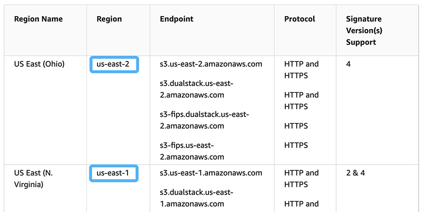
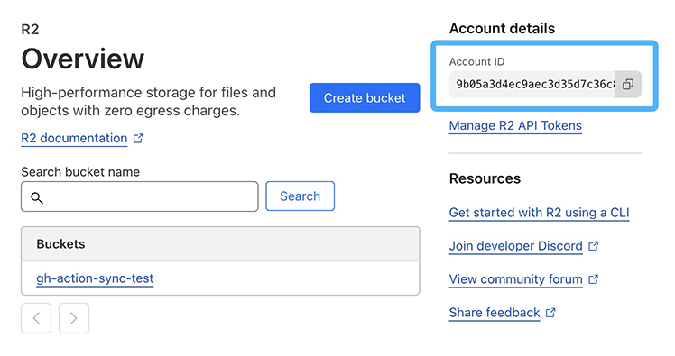
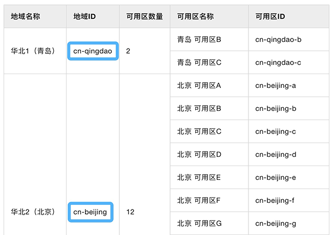
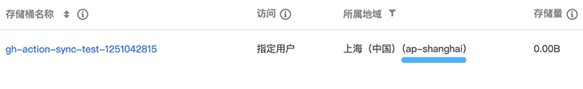
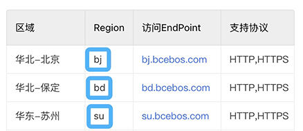

# Sync S3-Compatible Action

The `sync-s3-compatible-action` is a GitHub Action designed to synchronize files from a local directory to various S3-compatible cloud storage services. Works with:

- AWS S3
- CloudFlare R2
- Aliyun OSS
- QCloud COS
- Baidu Cloud BOS

The action performs intelligent synchronization by comparing the local directory with the remote storage and only uploading new or modified files.

## Environment Variables

The `sync-s3-compatible-action` takes the following environment variables as inputs:

| Name                 | Default | Required | Description                                                                      |
|----------------------|---------|----------|----------------------------------------------------------------------------------|
| SYNC_DIR             | `_site` | No       | Source directory to synchronize.                                                 |
| SYNC_TYPE            | `aws`   | No       | Cloud storage provider type: `aws`, `cloudflare`, `aliyun`, `qcloud`, `baidu`.   |
| SYNC_BUCKET          |         | Yes      | Storage bucket name.                                                             |
| SYNC_REGION          |         | Yes      | Region name or identifier.                                                       |
| SYNC_ACCESS_ID       |         | Yes      | API access ID.                                                                   |
| SYNC_ACCESS_SECRET   |         | Yes      | API aceess secret.                                                               |
| SYNC_OPT_UNUSED      | `keep`  | No       | How to handle files on cloud storage that don't exist locally: `keep`, `delete`. |
| REMOTE_IGNORE_PREFIX |         | No       | Always keep remote objects which path starts with. e.g. `download/files/`.       |

## Notes

- `SYNC_ACCESS_ID` and `SYNC_ACCESS_SECRET` are confidential and should NOT be written in GitHub action yaml. Add these values as [encrypted secrets](https://docs.github.com/en/actions/security-for-github-actions/security-guides/using-secrets-in-github-actions) and pass the secrets as env inputs.
- Files which exist on cloud storage but not exist in local directory will be **keeped** by default. To remove unused files you must set `SYNC_OPT_UNUSED` to `delete` explicitly.
- Default value of `SYNC_DIR` is `_site`, which is specifically chosen to make it seamless to sync GitHub Pages content to cloud storage providers.

## Example

An example of GitHub Action shows how to generate GitHub pages and sync `_site` to AWS S3:

```yaml
# build-and-sync.yml
name: Build static site and sync to cloud storage.

on:
  push:
    branches: [$default-branch]
  workflow_dispatch:

permissions:
  contents: read

jobs:
  build:
    runs-on: ubuntu-latest
    steps:
      - name: Checkout
        uses: actions/checkout@v4
      - name: Setup Ruby
        uses: ruby/setup-ruby@8575951200e472d5f2d95c625da0c7bec8217c42 # v1.161.0
        with:
          ruby-version: '3.1'
          bundler-cache: true
          cache-version: 0
      - name: Build with Jekyll
        # Outputs to the './_site' directory by default
        run: bundle exec jekyll build --baseurl "${{ steps.pages.outputs.base_path }}"
        env:
          JEKYLL_ENV: production
      - name: Sync to Cloud Storage
        uses: michaelliao/sync-s3-compatible-action@v6
        env:
          # force delete unused files on cloud storage:
          SYNC_OPT_UNUSED: delete
          # "_site" is default value
          SYNC_DIR: _site
          SYNC_TYPE: aws
          # bucket must be exist in region:
          SYNC_REGION: us-west-1
          SYNC_BUCKET: gh-s3-sync-action-example
          # set at: Settings - Secrets and variables - Actions - Repository secrets:
          SYNC_ACCESS_ID: ${{ secrets.SYNC_ACCESS_ID }}
          SYNC_ACCESS_SECRET: ${{ secrets.SYNC_ACCESS_SECRET }}
          # ignore remote objects starts with 'download/':
          REMOTE_IGNORE_PREFIX: download/
```

## Configurations

### AWS

AWS regions can be found on [this page](https://docs.aws.amazon.com/general/latest/gr/s3.html):



### CloudFlare

The region of CloudFlare R2 must be set to your account id which can be found on R2 page:



### Aliyun

Aliyun regions can be found on [this page](https://help.aliyun.com/document_detail/40654.html):



### QCloud

The region of QCloud bucket can be found in bucket list page:



### Baidu Cloud

Baidu cloud regions can be found on [this page](https://cloud.baidu.com/doc/BOS/s/akrqd2wcx):


